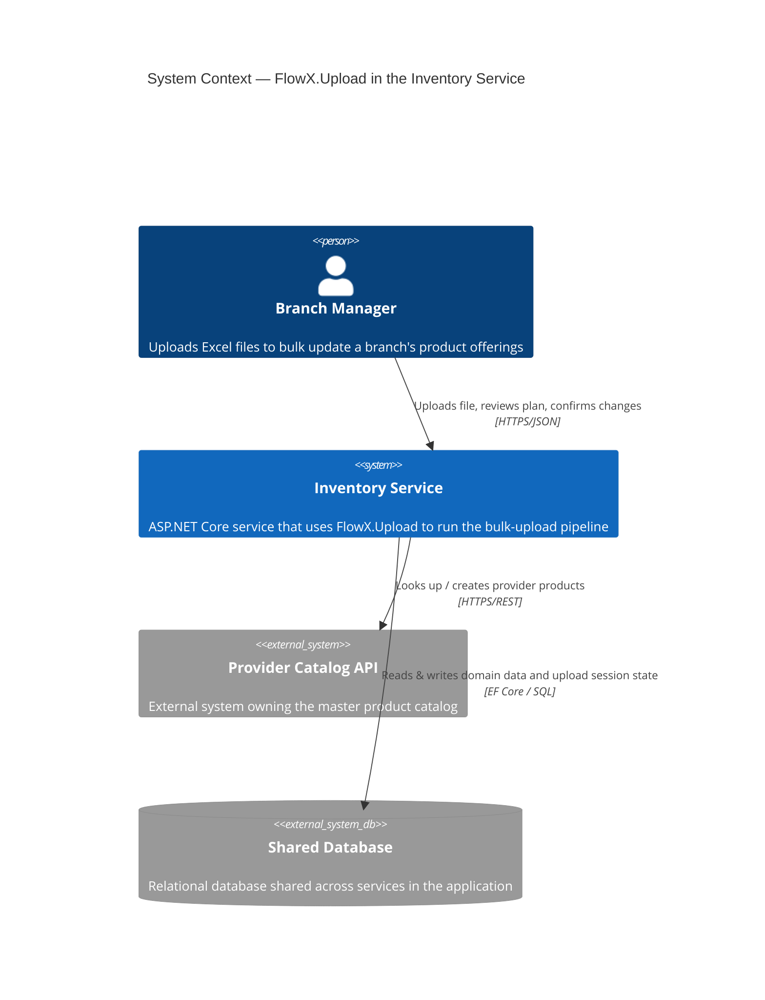
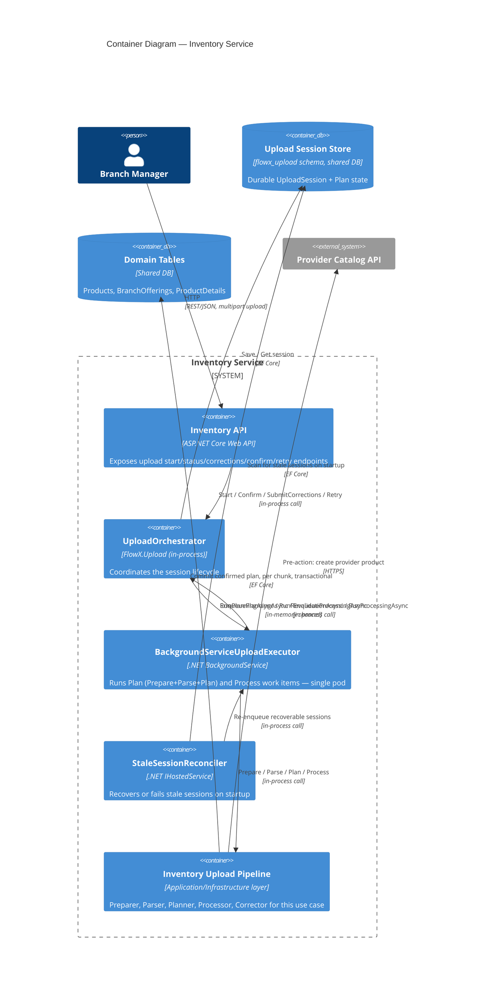
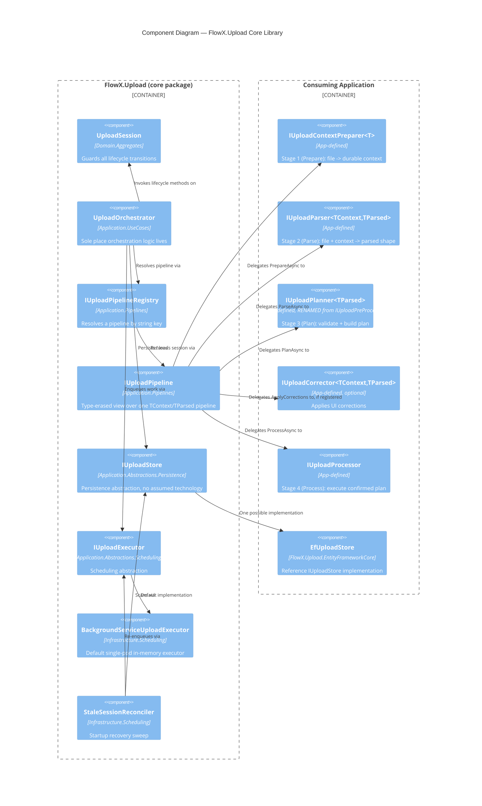

# Architecture — C4 Diagrams

Three levels, each zooming into the previous diagram's most relevant box.
See also [docs/state-diagram.md](state-diagram.md) for `UploadSession`'s
own state machine, which these structural diagrams intentionally don't
attempt to show.

## Level 1 — System Context

Unchanged by the rename — FlowX.Upload is invisible at this level, an
internal building block of the Inventory Service, not a separate system.

## Level 2 — Containers

Terminology updated: the background worker's enqueue/run methods are now
named for the Plan stage, not PreProcess.

## Level 3 — Components (inside FlowX.Upload)

`IUploadPreProcessor` renamed to `IUploadPlanner`; `PreProcessResult`
renamed to `PlanResult` (not shown as a component here — it's a return
type, documented in the usage guide). Folder namespace boundaries now
reflect the Clean Architecture layout (`Application.Abstractions.*`,
`Application.Pipelines`, `Application.UseCases`).

