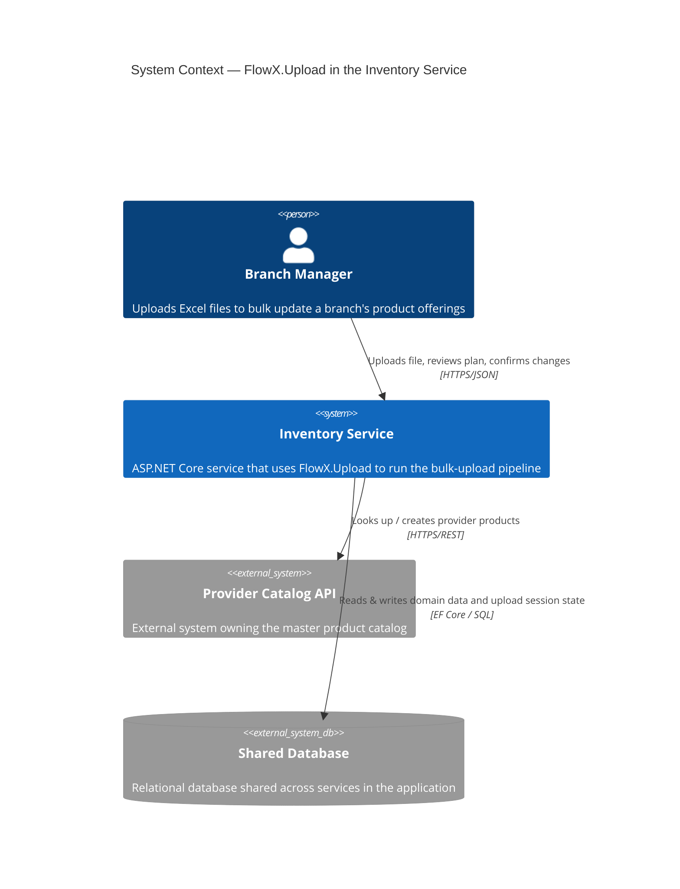
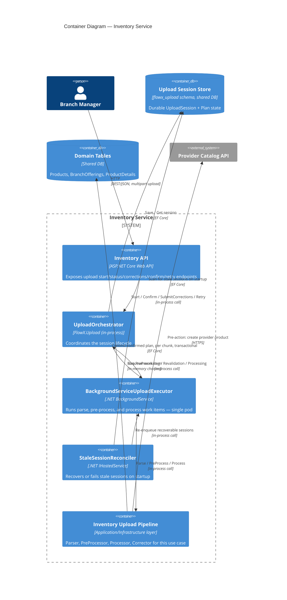
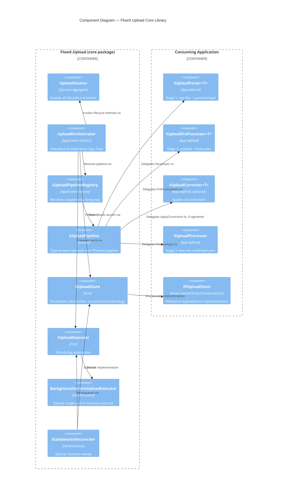

# Architecture — C4 Diagrams

Three levels, each zooming into the previous diagram's most relevant box.
If your Mermaid renderer doesn't support the `C4Context`/`C4Container`/
`C4Component` diagram types (they're relatively recent), render these via
the [Mermaid Live Editor](https://mermaid.live) or a renderer version that
supports them — this should be verified against the specific tool/version
you're viewing this in.

## Level 1 — System Context

Where FlowX.Upload sits relative to the people and external systems around
it, using the inventory bulk-upload use case as the concrete example.

**Reading this diagram:** FlowX.Upload itself is invisible at this level —
it's an internal building block of the Inventory Service, not a separate
system. That's intentional: it's a library, not a service, and shouldn't be
deployed or reasoned about independently.

## Level 2 — Containers

Zooming into the Inventory Service box above.

**Reading this diagram:** the upload session store and the domain tables are
drawn as separate containers even though they may be colocated in the same
physical database (see [docs/design.md](design.md#persistence)) — the
diagram reflects logical/schema ownership, not physical deployment.

## Level 3 — Components (inside FlowX.Upload)

Zooming into the package itself, showing the boundary between what the
package owns and what a consuming application implements.

**Reading this diagram:** everything in the "Consuming Application" boundary
is code the package never contains — this is the line the package must
never cross, per the layering decisions in
[docs/design.md](design.md#layering).
