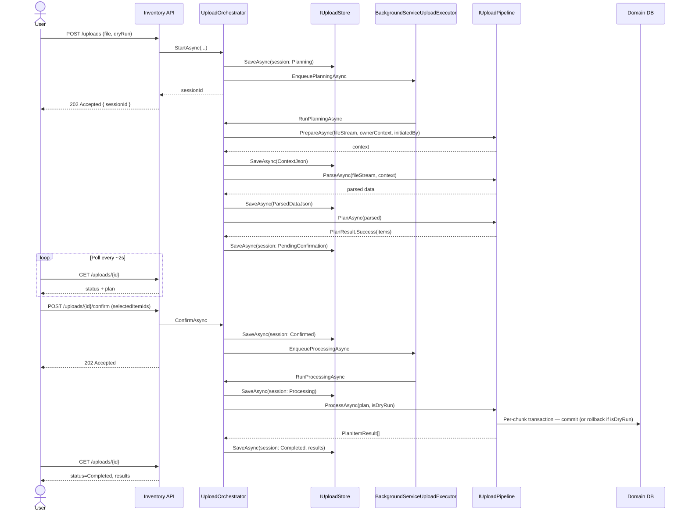
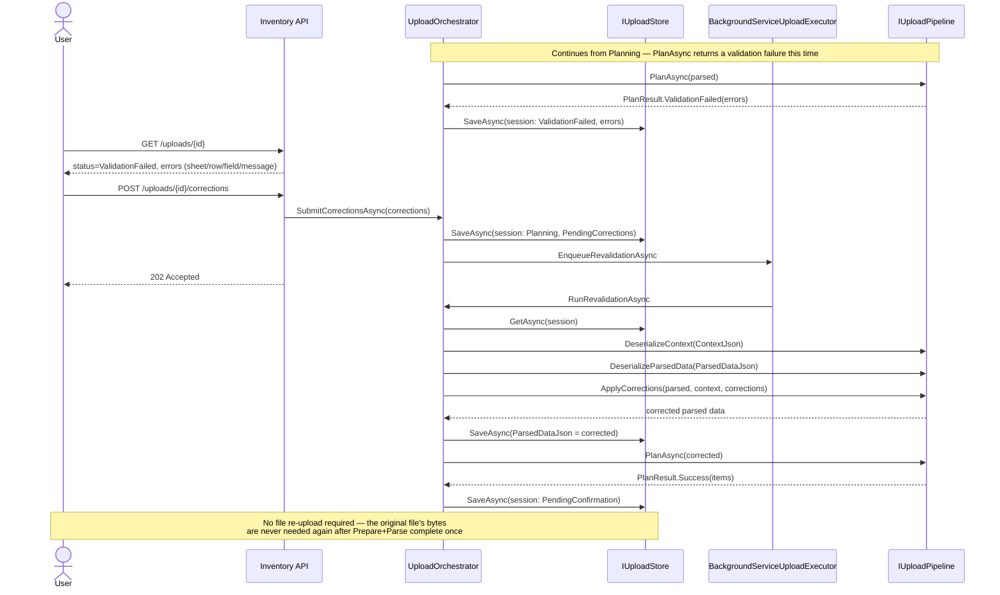

# Sequence Diagrams

Same three flows as before; method/status names updated for the Plan rename.

## 1. Happy path — start to completion



**Dry-run note:** identical flow; only the final DB step's commit/rollback
changes based on `session.IsDryRun`.

## 2. Correction loop — fix without re-upload



## 3. Crash recovery — pod restart during an in-flight session

```mermaid
sequenceDiagram
    participant Host as .NET Host (pod)
    participant Reconciler as StaleSessionReconciler
    participant Store as IUploadStore
    participant Exec as IUploadExecutor

    Note over Host: Pod restarts (crash, redeploy)
    Host->>Reconciler: StartAsync (on host startup)

    Reconciler->>Store: GetByStatusOlderThanAsync(Processing, 10m)
    Store-->>Reconciler: [stale sessions]
    loop each stale Processing session
        Reconciler->>Store: session.MarkFailed(...); SaveAsync
    end

    Reconciler->>Store: GetByStatusOlderThanAsync(Confirmed, 10m)
    Store-->>Reconciler: [stale sessions]
    loop each stale Confirmed session
        Reconciler->>Exec: EnqueueProcessingAsync(sessionId)
    end

    Reconciler->>Store: GetByStatusOlderThanAsync(Planning, 10m)
    Store-->>Reconciler: [stale sessions]
    loop each stale Planning session
        alt ContextJson and ParsedDataJson are both set
            Reconciler->>Exec: EnqueueRevalidationAsync(sessionId)
            Note right of Reconciler: Prepare+Parse already succeeded —<br/>only the Plan step was interrupted
        else either is null
            Reconciler->>Store: session.MarkFailed("please re-upload"); SaveAsync
            Note right of Reconciler: Known gap — raw file bytes only ever<br/>lived in the in-memory queue, unrecoverable
        end
    end
```

See [docs/design.md](design.md#known-limitations) for why the `else`
branch exists and what would remove it.
