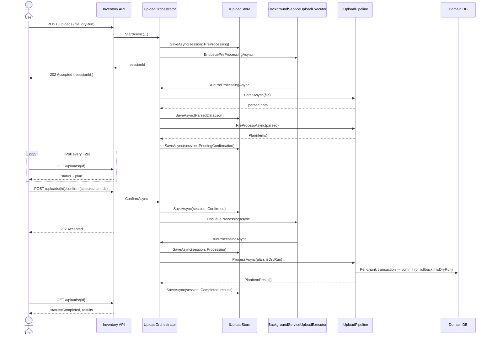
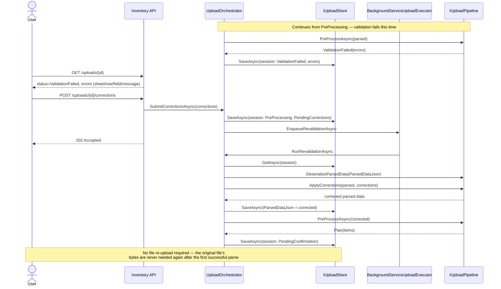

# Sequence Diagrams

Three flows, chosen because they're structurally distinct — not every branch
of the state machine gets its own diagram, only the ones that actually
differ in shape. Dry-run follows the same shape as the happy path with one
change (rollback instead of commit at the final step); it's called out as a
note on that diagram rather than duplicated.

## 1. Happy path — start to completion

Covers: async accept, background parse/validate, status polling, partial
confirmation, background processing.



**Dry-run note:** identical flow. The only change is the final DB step —
`ProcessAsync` still executes real writes against a transaction (so genuine
constraints, like a unique-date index, are exercised), but that transaction
is always rolled back rather than committed when `session.IsDryRun` is true.

## 2. Correction loop — fix without re-upload

Picks up from the `PreProcessAsync` step above, but this time validation
fails.



## 3. Crash recovery — pod restart during an in-flight session

Runs once, on host startup, for every session — not triggered by any user
action. This is what makes the single-pod / no-durable-queue constraint
survivable.

```mermaid
sequenceDiagram
    participant Host as .NET Host (pod)
    participant Reconciler as StaleSessionReconciler
    participant Store as IUploadStore
    participant Exec as IUploadExecutor

    Note over Host: Pod restarts (crash, redeploy)
    Host->>Reconciler: StartAsync (on host startup)

    Reconciler->>Store: GetByStatusOlderThanAsync(Processing, 10m)
    Store-->>Reconciler: [stale sessions]
    loop each stale Processing session
        Reconciler->>Store: session.MarkFailed(...); SaveAsync
        Note right of Reconciler: No partial resumability by design —<br/>user re-confirms and retries the same plan
    end

    Reconciler->>Store: GetByStatusOlderThanAsync(Confirmed, 10m)
    Store-->>Reconciler: [stale sessions]
    loop each stale Confirmed session
        Reconciler->>Exec: EnqueueProcessingAsync(sessionId)
        Note right of Reconciler: Plan is durable — only the in-memory<br/>enqueue was lost, safe to redo
    end

    Reconciler->>Store: GetByStatusOlderThanAsync(PreProcessing, 10m)
    Store-->>Reconciler: [stale sessions]
    loop each stale PreProcessing session
        alt ParsedDataJson is set
            Reconciler->>Exec: EnqueueRevalidationAsync(sessionId)
        else ParsedDataJson is null
            Reconciler->>Store: session.MarkFailed("please re-upload"); SaveAsync
            Note right of Reconciler: Known gap — raw file bytes only ever<br/>lived in the in-memory queue, unrecoverable
        end
    end
```

See [docs/design.md](design.md#known-limitations) for why the
`ParsedDataJson is null` branch exists and what would remove it.
