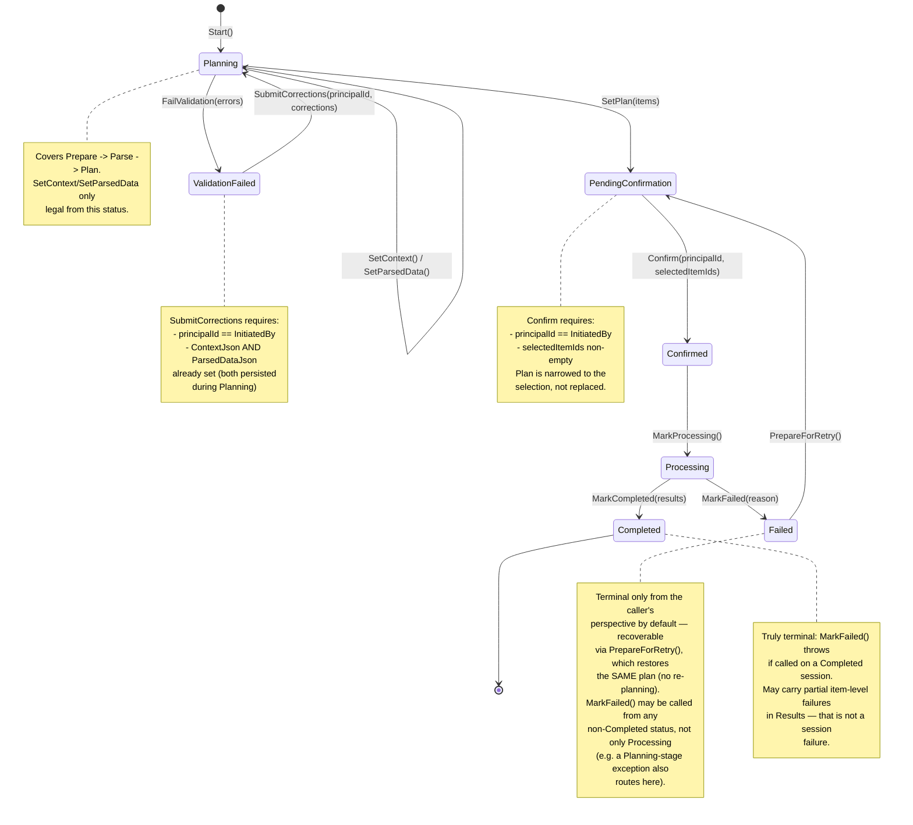

# State Diagram — `UploadSession`

**New in this revision.** The committee's reasoning for adding this diagram
type: `UploadSession` *is* a state machine — that's its entire domain
purpose. A state diagram shows every legal transition (and, by omission,
every illegal one, which the aggregate throws on) in one view, in a way
neither the C4 diagrams (structure) nor the sequence diagrams (one specific
run through the system) can. It's also a direct transcription of the
aggregate's own guard clauses in `Domain/Aggregates/UploadSession.cs` — not
an interpretive addition, so it can't drift from the code's actual behavior
without both being wrong together.

## Reading this diagram

- **Every arrow is a public method on `UploadSession`.** There is no path
  into `Failed` or between any two states that doesn't go through one of
  these guarded methods — this is what "the aggregate cannot be driven into
  an invalid state" means concretely.
- **`MarkFailed` is reachable from more states than the diagram's main
  spine shows explicitly** — per `UploadSession`'s guard, it's callable
  from any status except `Completed`. The diagram shows its primary
  trigger (from `Processing`, the most common real-world case: a crash or
  exception during execution) but the same transition applies from
  `Planning` (a Prepare/Parse/Plan-stage exception) as seen in
  `UploadOrchestrator.RunPlanningAsync`'s catch block.
- **There is no arrow from `Failed` back into `Planning`.** This is
  deliberate — session-level failure recovery re-confirms the *existing*
  plan (`PrepareForRetry` → `PendingConfirmation`), it does not re-run
  Planning. See [docs/design.md](design.md#known-limitations) for why
  partial/full re-planning after a failure isn't offered.
- **`ResetToConfirmed`** (used only internally by `StaleSessionReconciler`)
  is intentionally omitted from this diagram — it's not part of the
  public API surface a pipeline author or consumer ever calls directly,
  and showing it would suggest it's a normal application-level transition
  rather than an internal recovery mechanism. See
  [docs/sequence-diagrams.md](sequence-diagrams.md#3-crash-recovery) for
  where it's actually used.
